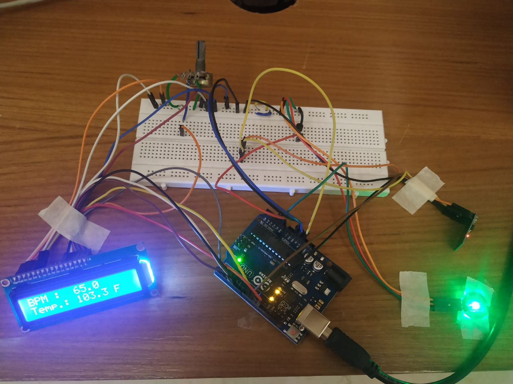

# Patient-Health-Monitoring-System
Designed and developed a Patient Health Monitoring System to continuously monitor the pulse rate and body temperature of the patient and transfer the data to a cloud platform with the help of IoT technology.

